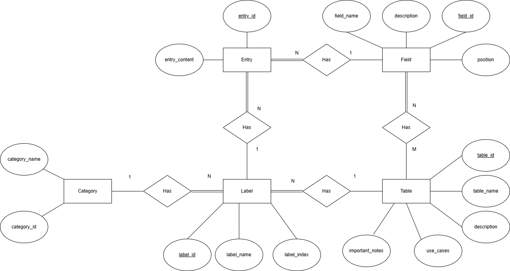

## Overview
This document provides step-by-step instructions for the Django backend set up, the database restore and setup, and the Angular frontend setup.


# Django Backend Setup

---

## Prerequisites

Ensure the following tools are installed on your machine:
- **Python 3.8+**
- **PostgreSQL** – Confirm with: `psql --version`
- **pip** – Python package installer
- **virtualenv** – Install with `pip install virtualenv`
- **Git** – To clone the repository
- **Node.js & Angular CLI** – For frontend integration

Check Python version with:
```bash
python3 --version
```

---

## Setup Instructions

1. Fetch Origin

2. Navigate to the Backend Folder

3. Create and Activate a Virtual Environment

```bash
python3 -m venv env
```

Activate the virtual environment:
- **macOS/Linux**:
```bash
source env/bin/activate
```
- **Windows**:
```bash
env\Scripts\activate
```

4. Install Dependencies

Ensure having a `requirements.txt` file containing:
```text
Django>=4.0
djangorestframework
psycopg2-binary
django-cors-headers
```
Install all dependencies:
```bash
pip install -r requirements.txt
```

5. Apply Database Migrations
```bash
python manage.py migrate
```

6. Run the Development Server
```bash
python manage.py runserver
```

The backend will now be running at: http://127.0.0.1:8000/

---

## Verify Setup

### Health Check Endpoint
Visit the following URL in your browser to ensure the backend is running:
http://127.0.0.1:8000/api/health/

You should see the response:
```json
{
   "status": "Backend is running!"
}
```

---

# Database Connection Testing

### 1. Activate the virtual environment: **venv**

### 2. Ensure that you have **django** and **psycopg2** installed:
```bash
pip list
```

### 3. Test Database Connection
To verify that Django can connect to PostgreSQL, run:
```bash
python manage.py dbshell
```
If the connection is successful, it will enter the PostgreSQL shell (**psql**)

### 4. Inspect Tables in database
```bash
python manage.py inspectdb
```
This should return models corresponding to the existing tables in your database.

---

# SuperUser(Admin) credentials

1. Run:
```bash
python manage.py runserver
```
2. Go to http://127.0.0.1:8000/admin/

- Username: `lasdd_superuser`
- Password: `lasdd12345`

---

# Angular Service & Django REST API Integration

## **Overview**
This document provides a description of steps taken to integrate an Angular frontend "http://localhost:4200/tables" to fetch and manage data from the Django REST Framework (DRF) backend "http://127.0.0.1:8000/tables/".

---

## **Step 1: Setting Up the Backend (Django REST Framework)**

### **1.1 Create API Using ModelViewSet**
- Implemented a Django model `Table` with fields:
  - `table_id` (IntegerField, primary key)
  - `table_name` (CharField, unique=True)
  - `description`, `use_cases`, `important_notes` (TextFields)
- Created a **serializer** (`TableSerializer`) to handle data validation.
- Developed a **ViewSet** (`TableViewSet`) using `ModelViewSet` for CRUD operations.
- Registered API routes in `urls.py` using Django REST Framework’s `DefaultRouter`.
- Applied migrations to update the database.

### **1.2 Install CORS in Backend**
```bash
pip install django-cors-headers
```

---

## **Step 2: Setting Up the Frontend (Angular)**

### **2.1 Generate Angular Service**
```bash
ng generate service services/table
```

- Implemented API calls using `HttpClientModule` to interact with the Django backend.
- Methods included:
  - `getTables()`
  - `getTable(id)`
  - `createTable(table)`
  - `updateTable(id, table)`
  - `deleteTable(id)`

### **2.2 Import `HttpClientModule` in Angular**
- The Angular project used a `shared.module.ts` instead of `app.module.ts`, so we ensured `HttpClientModule` was correctly imported and provided.

---

## **Step 3: Connecting Backend & Frontend**

### **3.1 Handling CORS in Django**
In `settings.py`:
```python
INSTALLED_APPS = [
    ...
    'corsheaders',
    'rest_framework',
]

MIDDLEWARE = [
    ...
    'corsheaders.middleware.CorsMiddleware',
    'django.middleware.common.CommonMiddleware',
]

CORS_ALLOWED_ORIGINS = ["http://localhost:4200"]
```

### **3.2 Running Backend and Frontend Concurrently**
```bash
python manage.py runserver
ng serve --open
```

---

## **Step 4: Testing CRUD Operations**

### **4.1 Testing in the Browser**
- **GET (Retrieve Tables)**: Verified that tables were displayed correctly.
- **POST (Add Table)**: Successfully added new entries.
- **DELETE (Remove Table)**: Deleted entries were removed both in the frontend and backend.
- **PATCH/PUT (Update Table)**: Implemented functionality for updating table names and descriptions.

### **4.2 API Testing via Django REST Framework UI**
- Used DRF’s built-in API interface at `127.0.0.1:8000/api/tables/` to manually test CRUD operations.

### **4.3 Running Pytest Backend Unit Tests**
- Backend logic is tested using `pytest`. To run all tests from the backend directory:
```bash
pytest
```
- To run a specific test file:
```bash
pytest tests/test_tables.py
```
- To include code coverage in your test run:
```bash
pytest --cov=. --cov-report=term-missing
```
- Make sure your virtual environment is activated when running tests.

### **4.4 Testing SQL Logic Scripts**
- Database validation logic is tested using Python scripts in a separate directory.
- Navigate to the directory where SQL verification scripts are located:
```bash
cd Documents/SQL_Scripts
```
- Use the general command below to run any of the verification scripts:
```bash
python <file_name>.py
```
> Replace `<file_name>` with the appropriate script name (e.g., `Verify_Student_Class`, `Verify_Term`, etc.).

---

# Entity Relationship Diagram

Below is the ERD representing how core models relate in the backend:



---

# Troubleshooting

Here are a few common issues and how to resolve them:

### 1. PostgreSQL Not Connecting
- Make sure PostgreSQL is running:
  ```bash
  sudo service postgresql start
  ```
- Verify `settings.py` DB credentials match your local DB setup.
- Confirm `psycopg2` is installed: `pip install psycopg2-binary`

### 2. Port 8000 Already in Use
- Kill the process using it:
  ```bash
  lsof -i :8000
  kill -9 <PID>
  ```
  Or run Django on a different port:
  ```bash
  python manage.py runserver 8001
  ```

### 3. Static Files Not Loading (Admin Panel)
- Run collectstatic if needed:
  ```bash
  python manage.py collectstatic
  ```

---

# Database restore

## **1. Restore Strategy for Windows using CLI**

### **Restore Steps:**
1. Locate Backup File
2. Drop and recreate schema:
```cmd
psql -U postgres -d las_data_dictionary -c "DROP SCHEMA public CASCADE; CREATE SCHEMA public;"
```
3. Restore using pg_restore:
```cmd
pg_restore -U postgres -d las_data_dictionary -v "C:\...\Database_Backups\backup_file.sql"
```
4. Verify with pgAdmin or:
```sql
SELECT * FROM core_table;
```
---

## **2. Restore Strategy of .sql file using pgAdmin**

### **Restore Steps:**

> You must create an empty database first to restore into.

1. In pgAdmin, right-click **Databases** > **Create > Database**.
2. Name it (for ex., `las_data_dictionary_restored`).
3. Set the correct **owner** (for ex., `postgres`).
4. Click **Save**.
5. Right-click on the database you just created.
6. Choose **Restore**
7. In the **Restore Options** window:
   - **Format**: Choose `Custom`.
   - **Filename**: Click the folder icon and select your `.sql` file.
   - **Role name**: Select appropriate role ( `postgres`).
8. Click the **Restore** button.

### Confirmation
- pgAdmin will run and display progress logs.
- Once complete, the new database will be populated with both schema and data from the backup.

---

# IMPORTANT: 
After the database is restored on your machine using your server, correct the Database settings in **settings.py** file in backend  to the ones .

#### Current settings. Please update
```python
DATABASES = {
    'default': {
        'ENGINE': 'django.db.backends.postgresql',
        'NAME': 'las_data_dictionary',
        'USER': 'postgres',
        'PASSWORD': '0000',
        'HOST': '18.220.136.53',
        'PORT': '5432',
    }
}

```

---


# LaSDataDictionary - Frontend

---
## Prerequisites


Ensure the following tools are installed in your machine:
- **Angular CLI 18.2.11+** - For frontend integration
- **Node.js** – For frontend integration
- **Python 3.8+**
- **PostgreSQL** – Confirm with: `psql --version`
- **pip** – Python package installer
- **virtualenv** – Install with `pip install virtualenv`
- **Git** – To clone the repository


Check Angular CLI version with:
```bash
ng version
```
## Setup Instructions


1. Fetch Origin


2. Navigate to the root directory


3. (Optional, should only be needed when setting up a new package-lock.json) Gain access to the ASU Unity Stack. This can be done with the following link: https://asudev.jira.com/servicedesk/customer/portal/2


4. (Optional, should only be needed when setting up a new package-lock.json) Edit the npmrc.example folder with a valid git access token.


**IMPORTANT NOTE:**  When cloning and building the project make sure to create a git access token with the read permissions enabled. Once the token is created, edit the npmrc file to contain the token and rename the file from .npmrc.example to .npmrc so the correct dependencies can be downloaded from the ASU unity stack package directory.


5. Install all modules and dependencies with the following command in the root directory:


```bash
npm npm ci --legacy-peer-deps
```


**IMPORTANT NOTE:** When installing the node modules it is important to use `npm ci --legacy-peer-deps` to install the correct modules. DO NOT USE **npm install** as this will change the package.lock.json to your current dependency versions and your build will no longer be consistent with the development build. **npm install** should be reserved for when new tools are to being added to the build.


## Running the application


Once the backend and frontend architecture have been installed (backend instructions can be found in backend/README.md) you are ready to run the application following these steps.


1. Activate the virtual environment in the backend folder using the following command:


- **macOS/Linux**:
```bash
source env/bin/activate
```
- **Windows**:
```bash
env\Scripts\activate
```
2. Run the development backend server in the backend folder using the following command:


```bash
python manage.py runserver
```
The backend will now be running at: http://127.0.0.1:8000/


3. Run the development frontend server in the root directory using the following command:


```bash
ng serve
```
The frontend will now be running at: http://localhost:4200/


## Development server


Run `ng serve` for a dev server. Navigate to `http://localhost:4200/`. The application will automatically reload if you change any of the source files.


## Code scaffolding


Run `ng generate component component-name` to generate a new component. You can also use `ng generate directive|pipe|service|class|guard|interface|enum|module`.


## Build


Run `ng build` to build the project. The build artifacts will be stored in the `dist/` directory.


## Running unit tests


Run `ng test` to execute the unit tests via [Karma](https://karma-runner.github.io).


## Running end-to-end tests


Run `ng e2e` to execute the end-to-end tests via a platform of your choice. To use this command, you need to first add a package that implements end-to-end testing capabilities.


## Further help


To get more help on the Angular CLI use `ng help` or go check out the [Angular CLI Overview and Command Reference](https://angular.dev/tools/cli) page.
---
